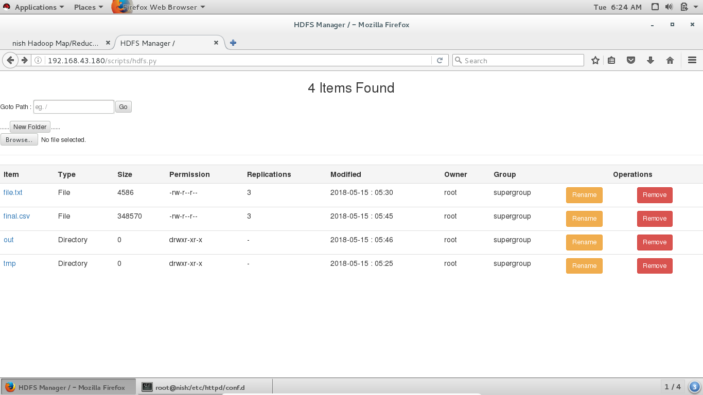
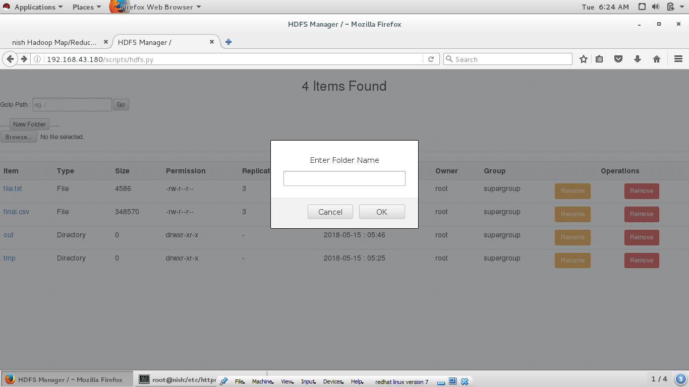
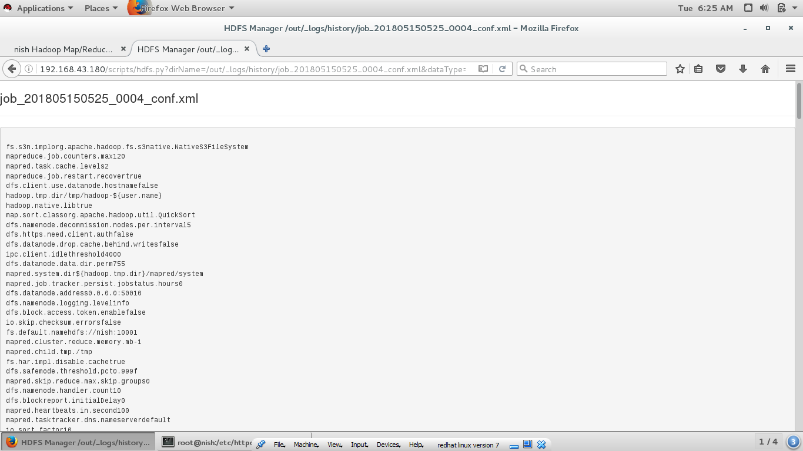

# HDFS-File-Manager

This is a HDFS web based file manager using python-cgi scripting

### Requirement :

* Hadoop v2
* Python 2.7
* Enabled Httpd and Cgi

## Enjoy your HDFS in an entire new way :fire: :fire:

### Screenshots

